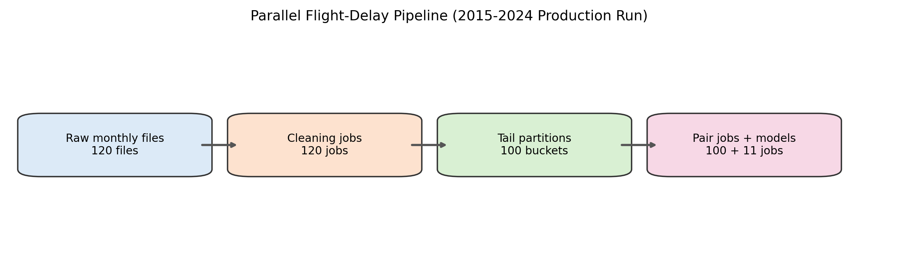
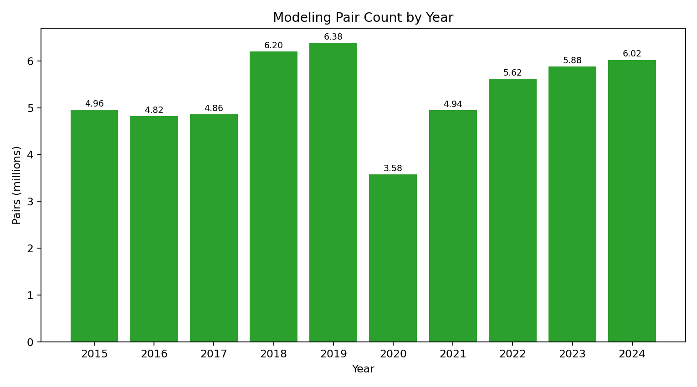
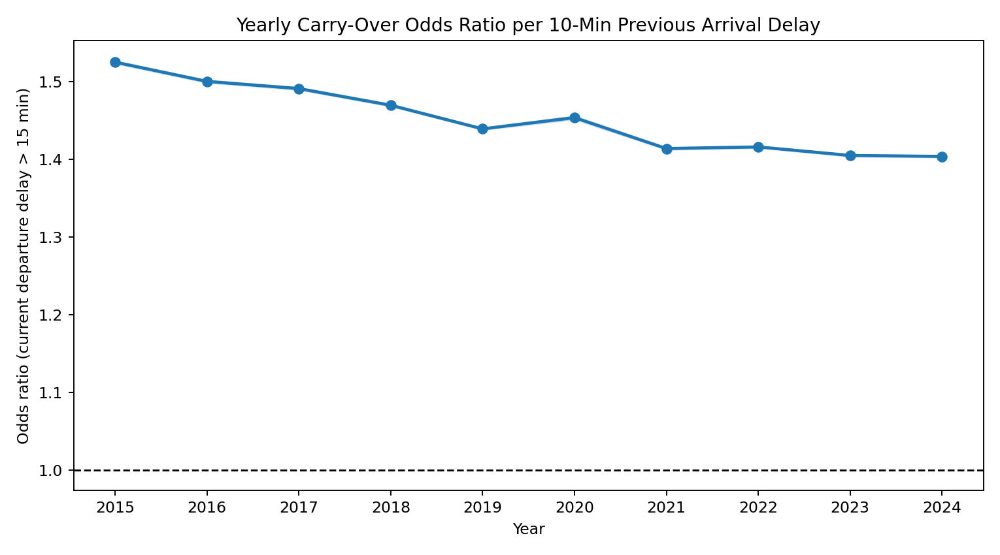
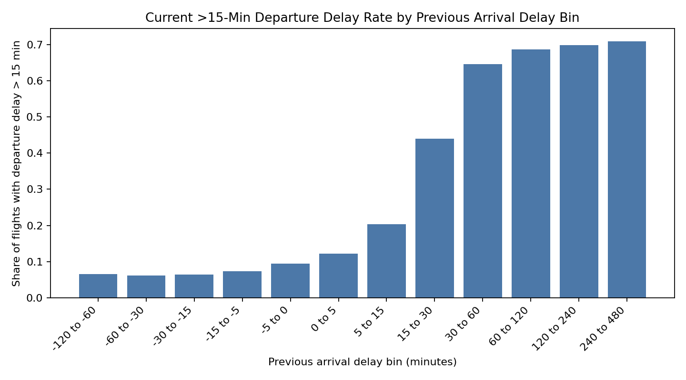
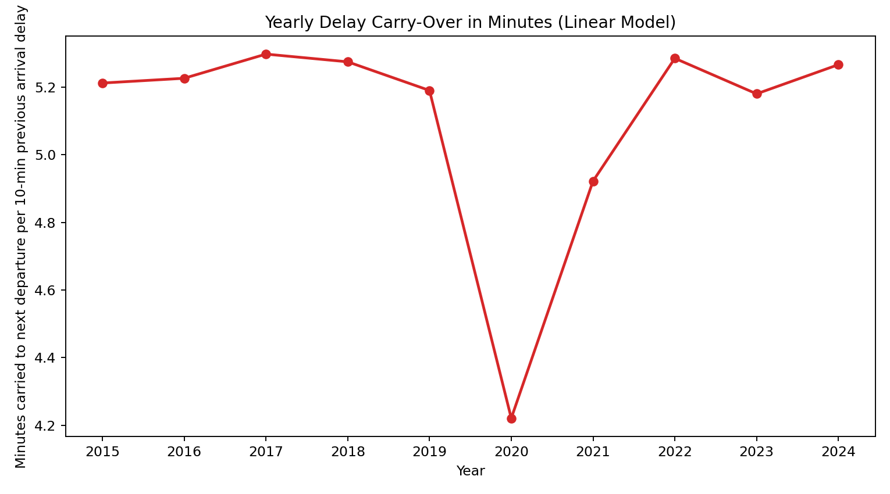
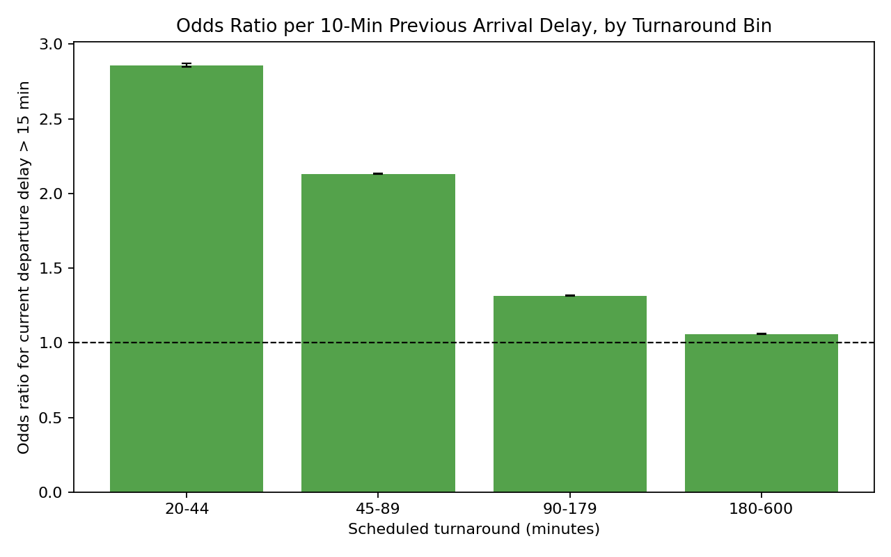
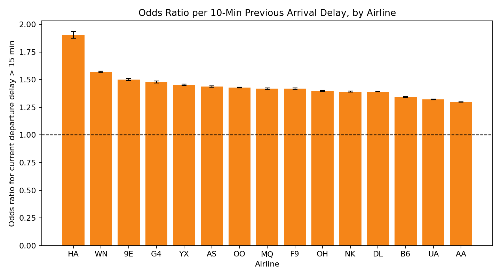
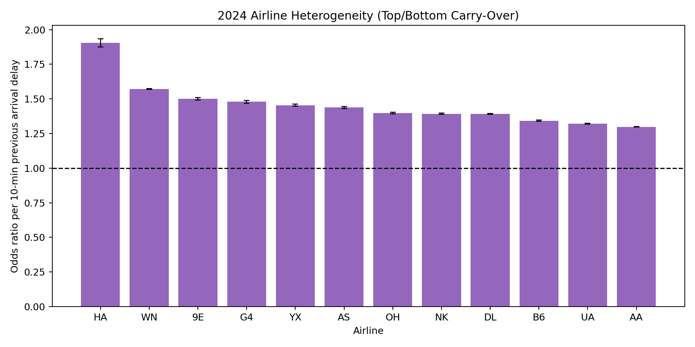

# Team Slides Playbook (Full SOP Version)
## Aircraft Delay Propagation in U.S. Domestic Flights (2015-2024)

This is the **full handoff document** for teammates.
It is written so someone who did not do the engineering work can still:

1. understand what was built,
2. explain methods and results correctly,
3. prepare final slides without guessing.

---

## 0) Executive Summary (Read This First)

We studied whether delay carries over from one flight to the next when both flights are operated by the **same aircraft** (`TAIL_NUM`).

Main findings:

- Across 2015-2024, delay propagation is consistently positive.
- In logistic models, +10 minutes of previous arrival delay is associated with about **1.45x** odds of severe next-leg departure delay (>15 min), on average.
- In linear models, +10 minutes previous arrival delay is associated with about **+5.11 minutes** of next-leg departure delay, on average.
- Propagation is much stronger when scheduled turnaround is short (especially 20-44 minutes).

---

## 1) Project Context and Scope

### 1.1 Research question

When a flight arrives late, how much of that delay carries over to later flights of the same aircraft, and how fast does it decay?

### 1.2 What is in the main story

- Primary: logistic carry-over model (risk framing)
- Secondary: linear carry-over model (minutes framing)
- Heterogeneity: airline + turnaround bin

### 1.3 What is not the main story

- Strict causal claims
- Full weather/ATC/mechanical causal decomposition
- Full decay-model deep dive (can be appendix)

---

## 2) Data Source, Size, and Time Range

### 2.1 Source

- U.S. Bureau of Transportation Statistics (BTS), monthly On-Time Performance files.

### 2.2 Time range used in production results

- 2015-01 through 2024-12.
- 10 years = 120 monthly files.

### 2.3 Size summary from this run

- Raw archive in project workspace: about **3.19 GB** (`stat605_2015_2024_raw.tar`)
- Cleaned rows assigned to global partitions: about **61,690,070**
- Final modeling pairs used: **53,268,469**
- 2024 modeling pairs: **6,021,015**

---

## 3) Folder Map (So Teammates Know Where Everything Is)

### 3.1 Code and submit files

- Scripts: `/Users/liyuang/Desktop/stat605/scripts`
- CHTC submit/helpers: `/Users/liyuang/Desktop/stat605/chtc`

### 3.2 Pulled results

- All yearly model outputs:
  - `/Users/liyuang/Desktop/stat605/results/chtc_pull/results_2015_2024_yearly`
- 2024 heterogeneity outputs:
  - `/Users/liyuang/Desktop/stat605/results/chtc_pull/results_2024_hetero/2024`

### 3.3 Final figure pack for slides

- `/Users/liyuang/Desktop/stat605/results/report_figures`

Key files there:

- `fig01_delay_rate_by_prev_delay_bin_2024.png`
- `fig02_carryover_by_airline_2024.png`
- `fig03_carryover_by_turnaround_bin_2024.png`
- `fig04_pipeline_parallel_flow.png`
- `fig05_prev_arr_delay_vs_current_dep_delay_2024.png`
- `fig06_yearly_or10_trend_2015_2024.png`
- `fig07_yearly_linear_minutes_trend_2015_2024.png`
- `fig08_pairs_by_year_2015_2024.png`
- `fig09_airline_top_bottom_2024.png`

---

## 4) Variables and Feature Definitions

### 4.1 Core fields kept from BTS

- `TAIL_NUM`
- `FL_DATE`
- `OP_UNIQUE_CARRIER`
- `ORIGIN`, `DEST`
- `CRS_DEP_TIME`, `CRS_ARR_TIME`
- `DEP_DELAY`, `ARR_DELAY`
- `DISTANCE`
- `CANCELLED`, `DIVERTED`

### 4.2 Additional fields (if available)

- `MONTH`
- `DAY_OF_WEEK`
- `CRS_ELAPSED_TIME`
- `DEP_TIME`
- `ARR_TIME`

### 4.3 Derived fields used in modeling

- `sched_dep_hour`
- `sched_arr_hour`
- `sched_dep_timestamp`
- `sched_arr_timestamp` (overnight-corrected)
- `route = ORIGIN + "-" + DEST`
- `scheduled_turnaround_minutes`
- `same_airport_connection = 1(prev_DEST == current_ORIGIN)`
- `current_dep_delayed_15 = 1(current_DEP_DELAY > 15)`
- `prev_arr_delayed_15 = 1(prev_ARR_DELAY > 15)`
- `turnaround_bin` in:
  - `20-44`
  - `45-89`
  - `90-179`
  - `180-600`
- `dep_period` in:
  - `overnight`
  - `morning`
  - `afternoon`
  - `evening`

---

## 5) Cleaning and Pairing Logic (What Exactly Was Done)

### 5.1 Monthly cleaning rules

- Keep only required columns.
- Drop missing `TAIL_NUM`, `FL_DATE`, `CRS_DEP_TIME`, `CRS_ARR_TIME`.
- Remove cancelled and diverted flights.
- Keep negative delays (early flights).
- Build scheduled timestamps from date + CRS time.
- If scheduled arrival clock time appears earlier than scheduled departure, shift scheduled arrival by +1 day (overnight correction).

### 5.2 Pair construction rules

- Sort within each `TAIL_NUM` by scheduled departure timestamp.
- Pair each flight with the immediately previous flight of the same aircraft.
- Keep only same-airport transitions:
  - `prev_DEST == current_ORIGIN`
- Keep only realistic scheduled turnaround:
  - `20 <= scheduled_turnaround_minutes <= 600`

This gives the main propagation unit:

- previous-leg delay -> current-leg delay/risk.

---

## 6) Model Specifications (How to Explain in Slides)

### 6.1 Primary logistic model

Outcome:

- `current_dep_delayed_15`

Main regressor:

- `prev_ARR_DELAY`

Controls:

- `scheduled_turnaround_minutes`
- `current_sched_dep_hour`
- `current_DISTANCE`
- `C(OP_UNIQUE_CARRIER)`
- `C(current_month)`
- `C(current_day_of_week)`
- `C(dep_period)`
- `C(current_year)` when multi-year fit

Interpretation:

- odds ratio for severe departure delay per +10 min previous arrival delay.

### 6.2 Secondary linear model

Outcome:

- `current_DEP_DELAY`

Same controls as above.

Interpretation:

- minutes of expected next-leg departure delay carried from previous arrival delay.

### 6.3 Heterogeneity models (2024)

- Airline interaction:
  - `prev_ARR_DELAY * C(OP_UNIQUE_CARRIER)`
- Turnaround interaction:
  - `prev_ARR_DELAY * C(turnaround_bin)`

---

## 7) CHTC Runbook (Step-by-Step)

This section is intentionally detailed so a teammate can replicate the workflow.

### 7.1 Login

```bash
ssh yli2827@ap2001.chtc.wisc.edu
```

Then complete Duo push.

### 7.2 Go to project directory

```bash
cd ~/stat605_delay_pipeline
pwd
ls
```

### 7.3 Submit yearly main models (2015-2024)

Submit file used:

- `chtc/fit_delay_models_years_2015_2024_main.sub`

Command:

```bash
condor_submit chtc/fit_delay_models_years_2015_2024_main.sub
```

This submit template launches:

- 10 jobs (one per year, 2015 to 2024)
- script: `chtc/fit_delay_models_one_year.sh`
- model mode: main-model-safe mode (`--skip-heterogeneity`)

### 7.4 Monitor jobs

```bash
condor_q
condor_q -hold
condor_q <cluster_id> -nobatch
```

If held:

```bash
condor_q -hold
condor_q <cluster_id>.<proc_id> -better-analyze
```

Common hold reason seen in this project:

- `HoldReasonCode 34 / SubCode 102`
- means cgroup memory limit exceeded (OOM)

### 7.5 Retry heavy years with more memory

For heavy years (we observed 2018, 2019, 2024), use a retry submit with larger memory.

Submit file used:

- `chtc/fit_delay_models_retry_2018_2019_2024.sub`

Command:

```bash
condor_submit chtc/fit_delay_models_retry_2018_2019_2024.sub
```

### 7.6 Run 2024 heterogeneity model

Submit file used:

- `chtc/fit_delay_models_2024_hetero.sub`

Command:

```bash
condor_submit chtc/fit_delay_models_2024_hetero.sub
```

This runs:

- script: `chtc/fit_delay_models_one_year_hetero.sh`
- year: 2024
- no `--skip-heterogeneity`
- memory in run: 48GB

### 7.7 Pull results back to local machine

```bash
rsync -av yli2827@ap2001.chtc.wisc.edu:~/stat605_delay_pipeline/results_2015_2024_yearly/ \
  /Users/liyuang/Desktop/stat605/results/chtc_pull/results_2015_2024_yearly/

rsync -av yli2827@ap2001.chtc.wisc.edu:~/stat605_delay_pipeline/results_2024_hetero/2024/ \
  /Users/liyuang/Desktop/stat605/results/chtc_pull/results_2024_hetero/2024/
```

---

## 8) Job Splitting Logic (Why We Split This Way)

### 8.1 Stage-level split

- Cleaning: monthly split (naturally parallel, low coupling)
- Pair building: partition split by `hash(TAIL_NUM) % 100` (keeps aircraft integrity)
- Modeling: initially attempted pooled windows; then moved to yearly jobs for memory stability

### 8.2 Why yearly modeling was the practical winner

- Full pooled jobs had higher risk of OOM and no available high-memory slots.
- Yearly jobs were easier to schedule and recover.
- Only heavy years required memory bump reruns.

### 8.3 Actual practical pattern used

- Main results:
  - 10 yearly jobs
- Retry:
  - 3 heavy-year jobs with higher memory
- Heterogeneity:
  - 1 dedicated 2024 job

---

## 9) What Output Files Mean (So People Don’t Confuse Them)

Inside each year folder (for example `results_2015_2024_yearly/2024`):

- `main_result_table.csv`
  - one-row summary for slide-level reporting
- `secondary_linear_result_table.csv`
  - compact linear minutes interpretation
- `model_coefficients.csv`
  - coefficient-level details
- `model_metrics.csv`
  - AIC/deviance/ROC-AUC style metrics
- `logistic_delay_model_summary.txt`
  - full regression summary text
- `linear_delay_model_summary.txt`
  - full OLS summary text
- `figures/*.png`
  - model figures for communication

In 2024 heterogeneity folder:

- `airline_carryover_summary.csv`
- `turnaround_carryover_summary.csv`
- heterogeneity figure PNG files

---

## 10) Results Table for Slides (Copy-Paste Ready)

### 10.1 Yearly main effects

| Year | Pairs | Logistic OR per +10 min | Linear coefficient | Minutes carried per +10 min |
|---|---:|---:|---:|---:|
| 2015 | 4,956,280 | 1.525 | 0.5212 | 5.21 |
| 2016 | 4,824,439 | 1.500 | 0.5226 | 5.23 |
| 2017 | 4,862,737 | 1.491 | 0.5297 | 5.30 |
| 2018 | 6,201,714 | 1.469 | 0.5274 | 5.27 |
| 2019 | 6,380,395 | 1.439 | 0.5190 | 5.19 |
| 2020 | 3,575,671 | 1.453 | 0.4221 | 4.22 |
| 2021 | 4,943,061 | 1.414 | 0.4922 | 4.92 |
| 2022 | 5,620,042 | 1.416 | 0.5285 | 5.28 |
| 2023 | 5,883,115 | 1.405 | 0.5180 | 5.18 |
| 2024 | 6,021,015 | 1.403 | 0.5266 | 5.27 |

### 10.2 Aggregate summary numbers

- Total pairs: **53,268,469**
- Average OR per +10 min: **1.451**
- Average minutes carried per +10 min: **5.11**

### 10.3 2024 turnaround heterogeneity

| Turnaround bin | OR per +10 min |
|---|---:|
| 20-44 | 2.859 |
| 45-89 | 2.132 |
| 90-179 | 1.315 |
| 180-600 | 1.059 |

Interpretation:

- The shorter the turnaround buffer, the stronger the delay carry-over.

---

## 11) Recommended Slide Deck Structure (7 Slides)

### Slide 1: Question + Why It Matters

Message:

- Same-aircraft delay propagation affects reliability and passenger experience.

### Slide 2: Data + Scale

Include:

- 2015-2024, 120 monthly files
- 53.27M modeling pairs
- `fig08_pairs_by_year_2015_2024.png`

### Slide 3: Method and Pipeline

Include:

- Pair definition and filtering logic
- `fig04_pipeline_parallel_flow.png`

### Slide 4: Main Logistic Result

Include:

- `fig06_yearly_or10_trend_2015_2024.png`
- `fig01_delay_rate_by_prev_delay_bin_2024.png`

### Slide 5: Minutes Interpretation

Include:

- `fig07_yearly_linear_minutes_trend_2015_2024.png`
- optionally `fig05_prev_arr_delay_vs_current_dep_delay_2024.png`

### Slide 6: Heterogeneity

Include:

- `fig03_carryover_by_turnaround_bin_2024.png` (primary heterogeneity)
- `fig02_carryover_by_airline_2024.png` (secondary heterogeneity)

### Slide 7: Limitations + Operational Takeaway

Say explicitly:

- Association, not strict causality.
- Weather/ATC/mechanical confounders remain.
- Operational action point: protect short-turn buffers.

---

## 12) Figure Reference (With Inline Images)

### Pipeline and scale




### Main effects





### Heterogeneity





---

## 13) Common Mistakes to Avoid in Presentation

- Do not say “causes” unless causal identification is explicitly done.
- Do not over-interpret airline ranking without sample-size context.
- Do not use linear R-squared as the main success metric.
- Do not skip the turnaround story; it is the strongest operational result.
- Do not present 2024 heterogeneity as if it is a full 10-year heterogeneity study.

---

## 14) 45-Second Closing Script (Team Can Read Verbatim)

"Using 10 years of BTS domestic flight data and over 53 million same-aircraft flight pairs, we find stable delay propagation from one leg to the next.
In logistic terms, every additional 10 minutes of previous arrival delay is associated with roughly 1.45 times the odds of severe departure delay on the next leg.
In linear terms, that corresponds to about 5 extra minutes of departure delay carried forward.
The strongest heterogeneity is turnaround time: short-turn flights show much higher propagation, which suggests schedule buffer design is a practical lever for improving reliability."

---

## 15) Files to Share With Teammates

- This SOP (Markdown):
  - `/Users/liyuang/Desktop/stat605/results/report_figures/team_slides_playbook_en.md`
- HTML version:
  - `/Users/liyuang/Desktop/stat605/results/report_figures/team_slides_playbook_en.html`
- PDF version:
  - `/Users/liyuang/Desktop/stat605/results/report_figures/team_slides_playbook_en.pdf`

